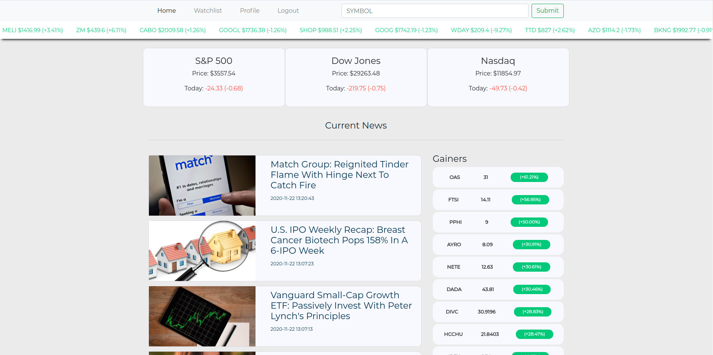
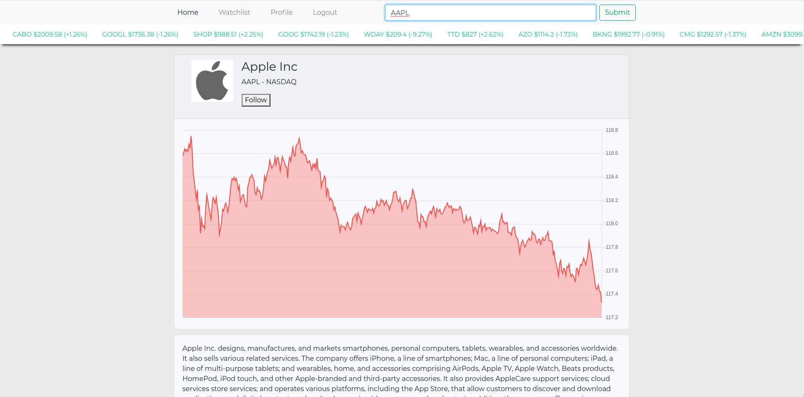

# Stock chart and data

This app was created for Springboard fullstack career track capstone 1 project
Search for a company and get stock chart and financial information.
Get current financial news, add company to watchlist.
login/logout, edit profile. The three major indexes quotes are updated every minute.

## Picture Of The App

 

## User Flow

- Users can get quick look at active stocks on the marquee, also gainers and losers.
- Users can search for a company and get relevant information.
- Users can get access to current financial news.
- Users can add companies to watchlist.

## Tools Used

- Flask (Python)
- PostgreSQL
- SQLAlchemy
- jQuery/Bootstrap
- Axios
- Bcrypt
